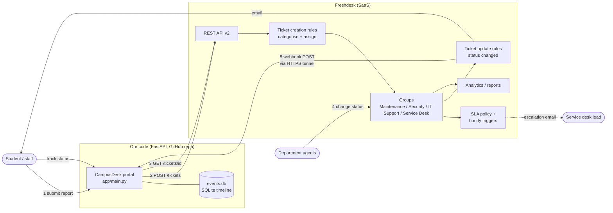

# CampusDesk — automatic categorisation with Freshdesk

*One place to report any campus problem.*


CSX4110 Backend Development · Project 02 

| Member | Student ID |
|---|---|
| Lwin Pyae Aung | 6726129 |
| Sitt Yan Htun | 6722114 |

## The pain point

- Students and staff report campus problems (blocked toilets, broken lights, locked rooms, Wi-Fi, email).
- Every report lands in one place and a person has to read it and decide which department handles it.
- Reports wait, go to the wrong department, get handled twice, or an urgent one is missed.
- The reporter cannot see who has their report or when it will be fixed.

## The fix

[Freshdesk](https://www.freshworks.com/freshdesk/) receives every report as a **ticket**. Automation rules
categorise it (Maintenance / Security / IT), assign it to that department's group, mark hazards
**Urgent**, and an SLA policy escalates anything not resolved in time. Status moves
**Open → Assigned → In Progress → Resolved → Closed**, and every change is pushed back to the portal
by webhook so the reporter can track it.

This repo is the code side: a service portal that talks to the Freshdesk REST API, receives its
webhooks, and proves the routing with a verification script.



## Results (measured)

| | Before (manual triage) | After (Freshdesk rules) |
|---|---|---|
| Time from report to correct department | _to measure: step 21_ s per ticket, office hours only | **1.9 s** median (1.4–2.7 s), day or night |
| Correctly routed, 12 sample reports | _to measure: step 21_ / 12 | **12 / 12** (`scripts/verify_routing.py`, real Freshdesk, 19 Sep 2026) |
| Reporter can see status | no | yes: timeline updated by webhook about 1 s after each change |
| Urgent hazards flagged | when someone notices | automatically: respond in 15 min, fix in 1 h, 24/7, escalated if missed |

## Try it in 2 minutes (no Freshdesk account needed)

Demo mode runs the whole portal against a pretend Freshdesk in memory. It routes reports with
exactly the same rules the real Freshdesk was configured with, and starts with 12 sample reports.

```bash
git clone https://github.com/ZaydenMiles/CampusDesk.git && cd CampusDesk
make install
make demo
```

Then open:

| Page | What to try |
|---|---|
| http://localhost:8000 | Pick an example, **Submit**: see which department it was routed to and how urgent it is |
| http://localhost:8000/track | Follow a report through Open → Assigned → In Progress → Resolved → Closed. In demo mode, **"Demo: agent moves it to the next status"** plays the staff member |
| http://localhost:8000/dashboard | Totals, charts by department, status and priority, and the overdue list |
| http://localhost:8000/docs | The API, generated by FastAPI |

No `make`? `python3 -m venv .venv && .venv/bin/pip install -r requirements.txt`, then
`DEMO_MODE=1 .venv/bin/uvicorn app.main:app --port 8000`.

Tests need no account either: `make test`.

## Connect your own Freshdesk

1. Start a Freshdesk trial. Turn on API key access and copy your API key.
2. `cp .env.example .env` and fill in `FRESHDESK_DOMAIN`, `FRESHDESK_API_KEY` and a long `WEBHOOK_SECRET`.
3. `make setup` creates the groups, ticket types, statuses, Location field, the 5 categorisation
   rules, the SLA policy and the escalation trigger through the Freshdesk API. It is safe to run again.
4. In Freshdesk, set **Admin → Automations → Ticket Creation → "Execute all matching rules"**
   (the only setting with no API).
5. `make check` should print **Ready.** Then `make verify` should print **12/12 routed correctly**.
6. `make run` starts the portal. In a second terminal, `make tunnel` opens a public URL and points
   the Freshdesk webhook at it, so status changes appear in the portal's timeline.

| Command | What it does |
|---|---|
| `make demo` | Portal with a pretend Freshdesk (no account) |
| `make run` | Portal against your real Freshdesk |
| `make tunnel` | Public HTTPS URL + updates the Freshdesk webhook to use it |
| `make setup` | Configures a Freshdesk account through the API |
| `make check` | Compares your Freshdesk setup with what the code expects |
| `make verify` | Creates 12 sample reports and checks each was routed correctly |
| `make report` | Counts by department / status / priority, SLA breaches |
| `python -m scripts.advance ID --walk` | Moves a ticket In Progress → Resolved → Closed |
| `make test` | All tests |

## Deploy on a server

The same code runs on a Linux server behind nginx with HTTPS (tested on an Azure Ubuntu 24.04 VM). After the install step, copy your `.env` into the folder (never commit it):

```bash
git clone https://github.com/ZaydenMiles/CampusDesk.git ~/campusdesk && cd ~/campusdesk
sudo apt-get install -y python3.12-venv
python3 -m venv .venv && .venv/bin/pip install -r requirements.txt
sudo cp deploy/campusdesk.service /etc/systemd/system/ && sudo systemctl enable --now campusdesk
sed "s/YOUR_HOSTNAME/your.domain/" deploy/nginx-campusdesk.conf | sudo tee /etc/nginx/sites-enabled/campusdesk
sudo nginx -t && sudo systemctl reload nginx
python -m scripts.setup_freshdesk --webhook-url https://your.domain:8443
```

| Piece | Role |
|---|---|
| `deploy/campusdesk.service` | systemd runs the app on `127.0.0.1:8001` and restarts it if it stops or the server reboots |
| `deploy/nginx-campusdesk.conf` | nginx serves it over HTTPS on port 8443 (reusing a Let's Encrypt certificate) and forwards to the app |
| Firewall | Allow TCP 8443 in the cloud firewall and on the server |
| Freshdesk | The webhook points at the server's fixed address, so no tunnel is needed |

## Honest limits

- Keyword rules are not understanding: typos and unusual wording fall through to the Service Desk.
- A report that mentions two problems goes to one department (the last matching rule).
- Only English keywords; Thai-language reports currently fall back to manual triage.
- If Freshdesk is unreachable the portal returns an error instead of queueing the report.
- The deployment is a single VM without a load balancer or managed database.
- Hourly triggers run once an hour, so time-based escalation is not instant.
- Student data lives in a third-party SaaS, which a real university would need to assess under PDPA.
